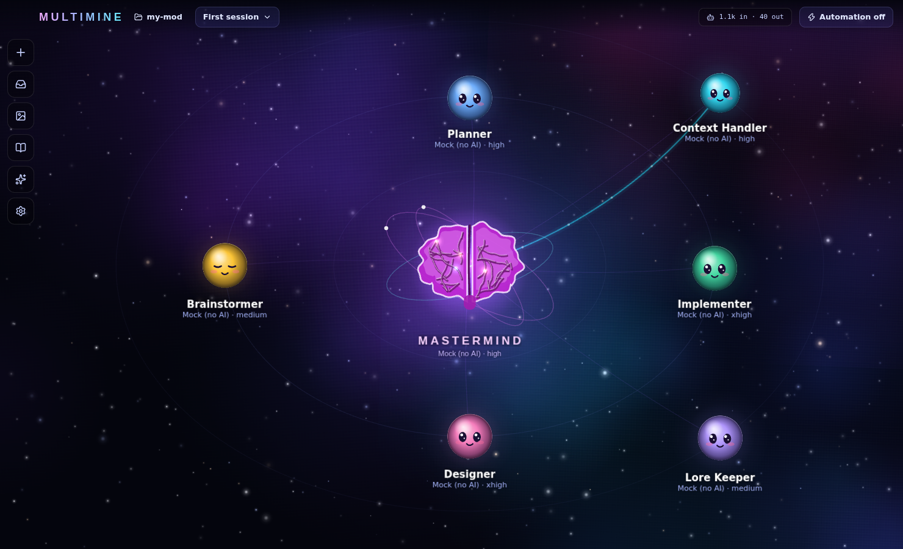

# Multimine

A desktop workstation for a team of AI agents. Every agent is a glowing chibi-faced orb in space;
**Mastermind** is the brain in the middle. Agents talk to each other over a shared bus (you see the
packets fly), ask you questions through Mastermind, and work on a real project folder.



## What it does

- **Agents with their own brains.** Each agent picks a provider, model and effort:
  - **Claude subscription** - driven through the Claude Agent SDK on your logged-in Claude Code (`claude`).
  - **ChatGPT subscription** - driven through `codex exec` on your logged-in Codex CLI.
  - **API keys** - Anthropic, OpenAI, Gemini, Groq, xAI, OpenRouter, or any OpenAI-compatible
    server (Ollama, LM Studio). Keys are encrypted with the OS keychain and never touch the project.
  - **Mock** - an offline stand-in, so you can try everything with no AI at all.
- **Roles and purpose files.** Every agent is `.multimine/agents/<id>.md`: YAML frontmatter (provider,
  model, effort, permissions, MCP tools, gated, plan mode) plus a markdown brief that becomes its
  system prompt. Templates ship for Planner, Implementer, Designer, Brainstormer, Context Handler, Asset
  Creator and Critic; Custom starts blank.
- **`multimine.md`** at the project root is shared guidance injected into every agent, like
  `CLAUDE.md` / `AGENTS.md`.
- **Mastermind orchestrates.** It can create and reconfigure agents, delegate tasks, run a council,
  and ask for approval. The pipeline lives in its own purpose file (edit it to change the process);
  the hard gates live in code.
- **Questions come to you.** Any agent's `ask_user` call - and Claude's own plan-mode
  `AskUserQuestion` - lands in the **Mastermind inbox** as a structured card. The agent waits until
  you answer.
- **Automation mode.** Toggle it on and Mastermind answers questions and approves plans on your
  behalf, logging why. `git push`, recursive deletes and similar always still wait for you.
- **Approval gate.** A *gated* agent (Implementer by default) refuses work unless Mastermind passes
  the id of an approved plan.
- **Council.** `run_council` sends a plan to N cheap critics with different lenses. Round one is
  blind; in round two each sees the others and must rebut or escalate. An approval only counts with
  at least three objections and none of them high - agreeing is never free.
- **Live links.** While one agent works on something another handed it, or waits on you, the line
  between them pulses and glows until the exchange ends.
- **Context Handler.** Create one and it maps the project into `.multimine/context/` (index,
  registries, one file per system, changelog). Every other agent is then told to read the map first
  and code second, and whenever an agent with write access changes the project, the Context Handler
  is sent the report and `git status` to update the map.
- **MCP tools.** Add any MCP server (stdio or HTTP) - Higgsfield, Meshy, WaveSpeed or anything
  else - and tick it on the agents that should have it. Images, video, audio and 3D models agents
  produce are saved to `.multimine/media/` and previewed in the chat and the **Media gallery**
  (glb/gltf in a 3D viewer).
- **Permissions.** Each agent has *Auto-approve permissions*: on, it never stops to ask (Claude
  accepts edits and runs commands, Codex runs with full access); off, every command, edit or tool use
  asks. Either way pushing, publishing and destroying history ask - as a speech balloon over the
  agent's orb with **Allow / Deny**, so you answer from the space view without opening the chat.
- **Long tasks never time out.** A handoff waits up to 10 minutes (Settings -> Economy & handoffs),
  then gives the caller its turn back; the report arrives later as a message of its own.
- **Economy mode** (top bar): agents keep answers short, and Mastermind rates each handoff light,
  standard or heavy. Light and standard tasks run on a cheaper model for that task only (Haiku or
  Sonnet for Claude agents by default; the table is in Settings) - the agent shows it in amber with a
  ⚡ and goes back to its own model afterwards.
- **Repository panel** (left rail): branch switch/create, changed files with diffs, stage and commit,
  pull and push, history, and on GitHub the open pull requests and issues and a new-PR form (through
  your `gh` login, or a token you paste). `.multimine/sessions` and `media` are git-ignored.
- **Asset Creator.** A role for generated art: Meshy for 3D models, WaveSpeed for images and video.
  Settings -> MCP servers has presets for both (add your key), and each server card lists every agent
  so you can switch access on and off in one click.
- **Sessions.** Agents belong to the project; conversations belong to a session. Create, rename,
  duplicate, switch. Claude and Codex threads resume per session.

## Running it

```bash
npm install
npm run dev        # the app with hot reload
npm run build      # production bundle in out/
npm start          # run the production bundle
npm run dist       # installer for your OS (electron-builder)
```

If your npm asks about install scripts, approve esbuild once (`npm install-scripts approve esbuild`);
it is the only package that needs one. The first `npm run dev` (or `npm start`) downloads the
Electron binary (`scripts/ensure-electron.mjs`); behind a proxy, set `HTTPS_PROXY` or
`ELECTRON_MIRROR`.

Open a project folder (your Minecraft mod, say). The first time, Multimine creates `multimine.md`,
`.multimine/` and a Mastermind, and offers a starting team.

### Subscriptions

- Claude: install Claude Code (`npm i -g @anthropic-ai/claude-code`), run `claude` once and log in.
- ChatGPT: install Codex (`npm i -g @openai/codex`) and run `codex login`.

Settings -> Providers shows whether each is found and logged in, and takes an explicit executable
path if they are not on `PATH`.

### Models

The model lists are presets (Fable 5.1, Opus 5.5, Sonnet 5.5, GPT 5.6 Sol, GPT 6 Astra, ...). Any id
can be typed in the agent editor, the lists are editable in Settings -> Models, and API providers
have **Refresh from vendor** to pull their live list.

## In the space view

- Click an orb to open its chat; double-click to edit it; drag to move it (positions are saved).
- Drag the sky to pan, scroll to zoom, double-click the sky to fit the whole team again.
- Faces follow state: thinking looks up, working squints, waiting shows a `?`, an error goes `> <`,
  and the mouth moves while text streams. The brain storms with sparks while Mastermind thinks and
  pulses amber while something waits on you.
- Link colours: delegate violet, report green, question amber, approval orange, critique red,
  context cyan, message blue.

## How it is built

```
src/shared/        types, agent-file format, effort mapping, model presets, role templates
src/main/
  app.ts           the API the window calls (projects, agents, sessions, settings)
  store/           project folder, sessions on disk, app settings + encrypted keys
  providers/       aiSdk (API keys), claudeCli (Agent SDK), codexCli (codex exec), mock
  orchestrator/    engine (turn queues, bus, inbox, gate, automation), council, prompts, workspace tools
  mcp/             busServer (local MCP server CLI agents call back into), hub (external MCP servers)
  media/           saving generated media
src/renderer/      React panels + a PixiJS space scene (space/)
templates/         multimine.md and the role templates
```

Every agent gets the same coordination tools (`message_agent`, `report`, `ask_user`, `list_agents`,
`read_context`, `show_media`; Mastermind adds `create_agent`, `update_agent`, `delegate`,
`request_approval`, `run_council`; the Context Handler adds `update_context`). API agents get them
in-process; Claude and Codex agents reach them over a loopback MCP server with a per-agent URL, so
every tool call knows who made it.

## Tests

```bash
npm test           # unit tests + a scripted end-to-end pipeline on mock agents
npm run test:e2e   # drives the real Electron app with Playwright and saves screenshots
```

On a machine without a display: `xvfb-run -a npm run test:e2e`.
