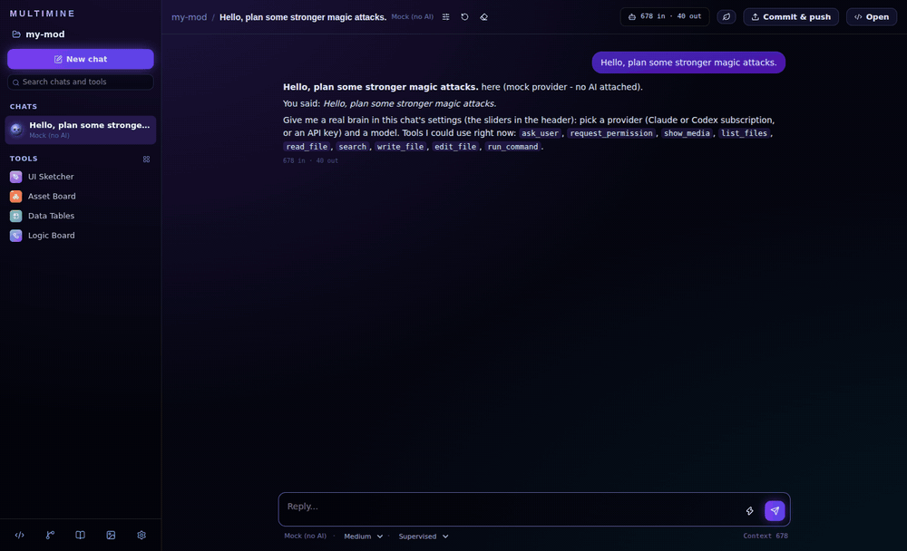
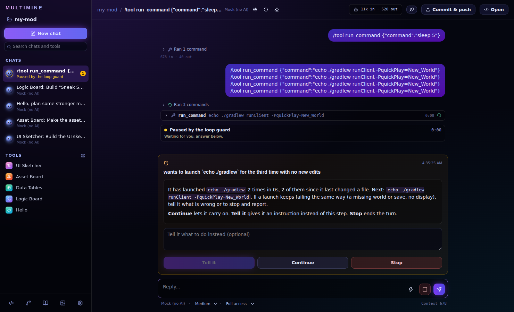
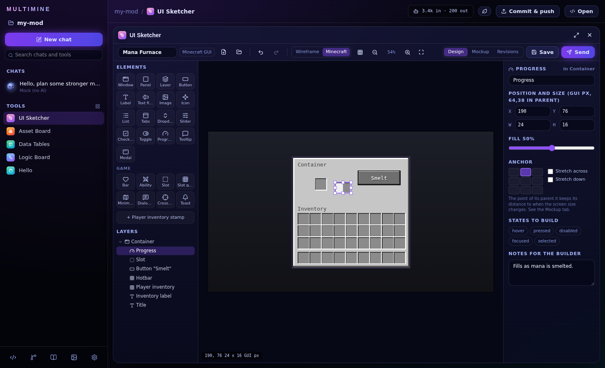
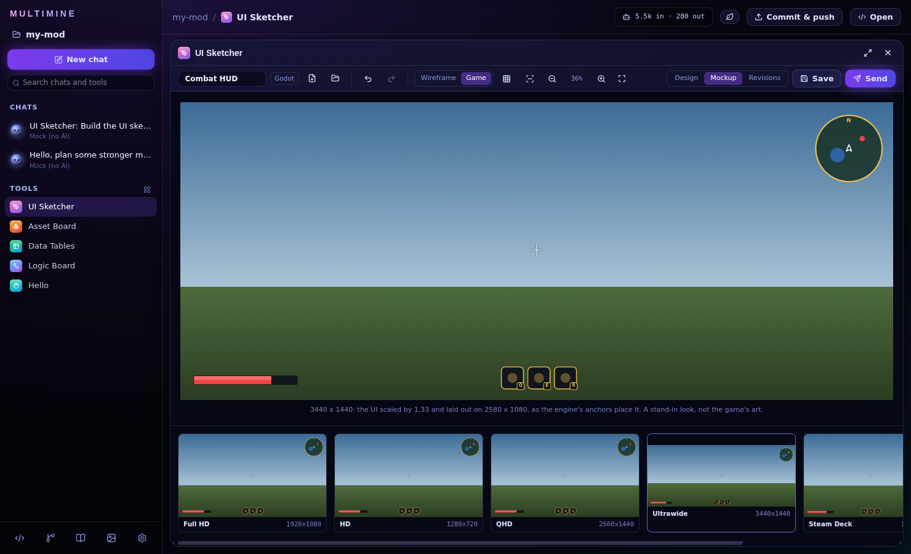
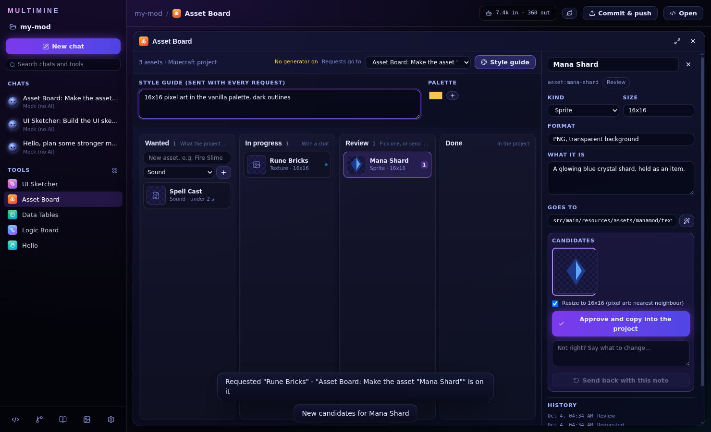
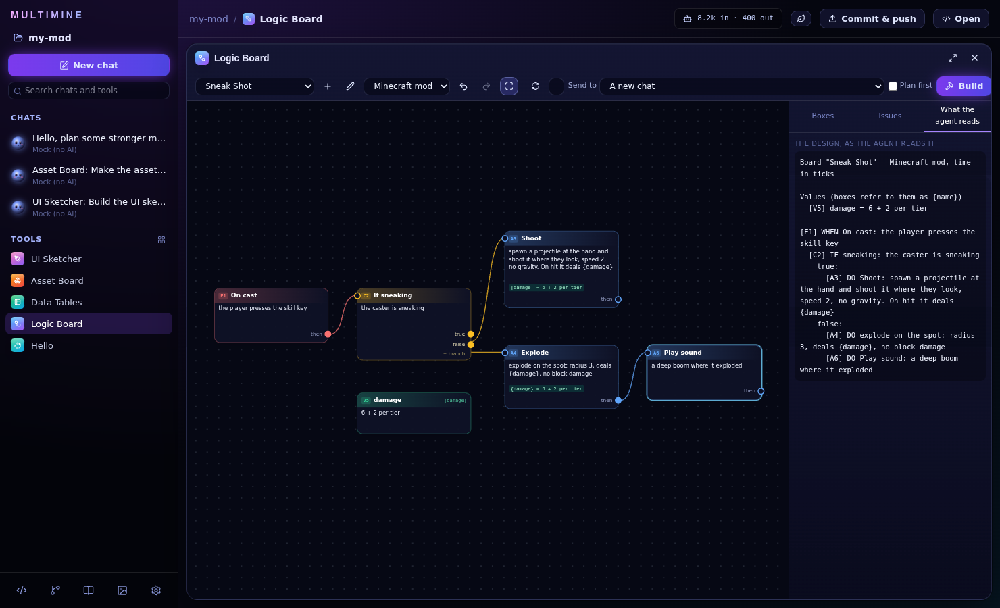
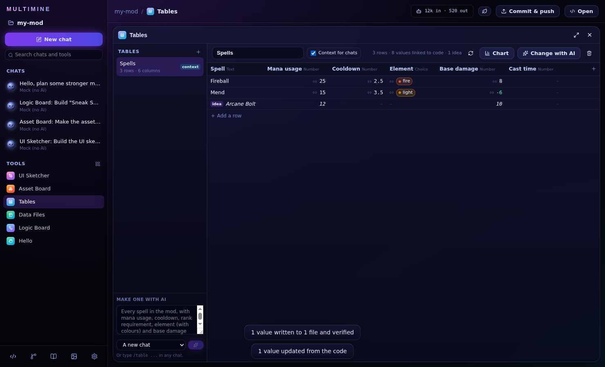
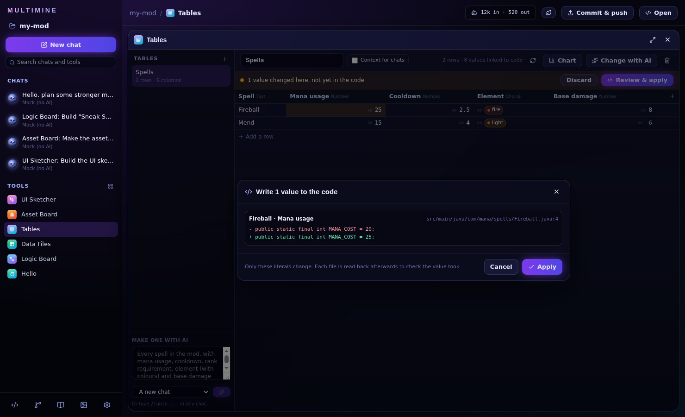

# Multimine

**A desktop app for your coding agents - Claude Code, Codex or any API model - with game-dev tools
built in and plugins for more.**

Open a project folder and chat with an agent that works in it, the way you would in Claude Code or
Codex, with as many chats running side by side as you like. Around the chat sit the tools nobody
else has: draw a HUD and have it built for Godot, Unity, Unreal or Minecraft; track the art the game
needs and drop the approved file into place; design a mechanic as boxes in plain words; keep your
spells, items and enemies in tables linked to the code, where editing a number edits the class. Any of them sends its work to a chat with one click.

> **Experimental.** Multimine is young and was built mostly with AI. It is developed on Windows and
> its test suite runs on Linux; macOS is untested. Expect rough edges, and please report them.



## Chats

- **One agent per chat, as many chats as you like.** Each chat has its own provider, model, effort
  and access, and keeps its own conversation. Chats run in parallel; the sidebar shows what each is
  doing ("Running gradlew runClient · 4:12") and which ones are waiting for you.
- **Providers.** Your **Claude** subscription through the Claude Agent SDK and your logged-in Claude
  Code; your **ChatGPT** subscription through `codex exec`; **API keys** for Anthropic, OpenAI,
  Gemini, Groq, xAI, OpenRouter or any OpenAI-compatible server (Ollama, LM Studio), encrypted with
  the OS keychain; and **Mock**, an offline stand-in, so you can try everything with no AI at all.
- **Pick the provider in the composer.** A new chat chooses Claude, ChatGPT, an API key or Mock from
  the pill under the message box. Once the conversation starts the chat keeps its provider (its
  conversation lives in that provider's session); the model can still change, and a new chat or a
  fresh start can use another provider.
- **Access, in the composer.** **Read only**, **Supervised** (asks before every edit and command)
  or **Full access**. Pushing, publishing and destroying history always ask, whatever the setting.
  Questions, plans and permissions are answered right in the chat.
- **`multimine.md`** at the project root is given to every chat, like `CLAUDE.md` or `AGENTS.md`.
  Fill in its "How to verify" section with your project's exact commands.
- **The loop guard.** A chat that relaunches the same game with nothing changed, repeats a step,
  cycles through the same few steps, or runs past its time or usage budget is paused and asks you:
  tell it what to do instead, let it continue, or stop it.



## The tools

Every tool opens beside the sidebar and sends its work to a chat you pick - a new one by default for
a build, so a long job does not clutter the conversation on screen. Follow-ups (a revision, an
update) go back to the chat that did the first one.

- **UI Sketcher.** Draw a game HUD, a menu or an app screen: 26 element types, from windows,
  buttons and lists to health bars, ability slots, minimaps and dialogue boxes, with nesting,
  snapping, layers and anchors. Targets **Godot**, **Unity**, **Unreal**, **Minecraft**, web, mobile
  and desktop, detected from the project. The **Mockup** tab lays the sketch out on every screen the
  target runs on (1080p to ultrawide, Steam Deck, a phone) the way that engine resolves anchors.
  **Send** asks a chat to build it the way the engine does, capture the real screen and show it in
  the gallery; **Revisions** marks the screenshot up and sends it back.
- **Asset Board.** The art and sound the project needs, as cards (Wanted, In progress, Review,
  Done), each with a spec and a path suggested for the engine. **Request** sends it to a chat; one the
  board starts gets your image and 3D generators (Meshy, WaveSpeed, Higgsfield over MCP, set up in
  Settings) switched on. Results come back through the gallery, and **Approve** copies the chosen one
  into place, resized to the spec.
- **Logic Board.** Design a mechanic the way Unreal blueprints look, but every box holds plain words:
  an event, a condition, an action, a wait, a loop, a named value. The Issues tab names whatever would
  leave an agent guessing. **Build** sends it as your approved design, so the chat builds it instead
  of planning it again, and writes a code map: each box then links to the line that implements it.
  Edit a built board and **Update** sends only what changed.
- **Tables.** Your project's numbers in one place - every spell with its mana, cooldown, element and
  damage, say - each cell linked to the literal in the code that holds it. Type `/table every spell
  with mana usage, cooldown, element (with colours) and base damage` in any chat and it builds the
  table from your code; every link is checked against the file before it counts. Edit a value in the
  table and **Review & apply** shows the exact line it will change, writes it, and reads the file back
  to verify it. Change the code and the table follows: the code is the truth. Add rows of your own as
  ideas with reference values, and **Build it** hands one to a chat with those values. Line and pie
  charts on demand, and **Context for chats** gives the table to every chat as a few compact lines,
  so it reads the numbers there instead of opening every class. No model is involved in reading or
  writing linked values.
- **Data Files.** The project's JSON and CSV data (items, enemies, loot, levels) as a spreadsheet
  with typed columns, validation, stats and a chart. A save changes only the edited lines. **Ask a
  chat** sends the selected rows and a question to the chat on screen.

| | |
|---|---|
|  |  |
|  |  |
|  |  |

## Around the chat

- **Code window:** a file tree with search, Monaco editor tabs that follow edits made elsewhere,
  **Open in IntelliJ / VS Code**, and terminals in the project folder, including one-click Claude
  Code and Codex terminals.
- **Repository panel:** branches, changed files with diffs, stage and commit, pull and push,
  history, and on GitHub the open pull requests and issues and a new-PR form.
- **Media gallery:** everything a chat generates or captures - images, video, audio, and 3D models in
  a viewer.
- **Desktop notifications** when a chat needs you and Multimine is in the background.

## Saving usage

- **Warm sessions.** Each Claude chat keeps its Claude Code process running between turns: a
  follow-up is one more message to a live process, with the prompt cache still warm.
- **⚡ Quick.** The bolt in the composer runs one message on your provider's light model (Haiku for
  Claude; a lower effort where no light model is set) and the chat goes back to its own model after.
- **Economy mode** (the leaf in the header): chats answer briefly. Optionally, one tiny call rates
  each message and easy ones run on the light model; anything unclear counts as hard.
- **A small, fixed prompt.** What Multimine adds to every model call is 2,647 characters for a chat
  that can write and 1,334 for a read-only one (with the template `multimine.md`); a test keeps it
  there. A large `CLAUDE.md` is outlined instead of sent whole on every call.
- **Fresh start.** Start a new conversation in the same chat, with a short recap, when the context
  meter turns amber.
- **Fallback providers.** When a provider runs out of usage or its login stops working, the turn
  carries on - in the same reply - on the next one in the chat's chain, briefed with everything
  already done. A paid API key asks first.
- **Usage you can see:** tokens per chat, and your Claude plan's 5-hour and weekly windows with a
  warning at 90%.

How much these save depends on how you work; they have not been benchmarked against real tasks yet.
The usage pill in the header shows what each chat spends.

## Plugins

A plugin is a folder with a `plugin.json`: a web page that runs walled off from the app (no keys,
no settings, no Node) and reaches it only through `window.multimine`, each call checked against the
permissions you granted. It can list your chats, send one a message or start a new one, read and
write project files, show media, and bring an MCP server of tools for your chats. The four tools
above are built the same way and hold no privileges a plugin could not have.

See [`docs/plugins.md`](docs/plugins.md) and [`examples/plugins/hello`](examples/plugins/hello).

## Running it

```bash
npm install
npm run dev        # the app with hot reload
npm run build      # production bundle in out/
npm start          # run the production bundle
npm run dist       # an installer for your OS (electron-builder; unsigned)
```

If npm asks about install scripts, approve esbuild once (`npm install-scripts approve esbuild`). The
first `npm run dev` (or `npm start`) downloads the Electron binary (`scripts/ensure-electron.mjs`);
behind a proxy, set `HTTPS_PROXY` or `ELECTRON_MIRROR`. On Windows the terminal uses node-pty's
bundled binary; `npm install-scripts approve node-pty` is recommended but not required.

Open a project folder. Multimine creates `multimine.md` and `.multimine/` (chats and media are
git-ignored), and a first chat on your default model.

### Subscriptions and keys

- Claude: install Claude Code (`npm i -g @anthropic-ai/claude-code`), run `claude` once and log in.
  New chats start on it when it is found.
- ChatGPT: install Codex (`npm i -g @openai/codex`) and run `codex login`.
- API keys: Settings -> Providers & keys.

Settings -> Providers shows whether each CLI is found and logged in, and takes an explicit path if it
is not on `PATH`. Settings -> General sets what new chats start with.

### Models

The model lists are presets. Any id can be typed in a chat's settings, the lists are editable in
Settings -> Models, and API providers have **Refresh from vendor** to pull their live list.

## How it is built

```
src/shared/        types, the chat format, effort mapping, model presets
  sketch/ logic/ assets/ data/   the tools' pure logic (unit tested)
src/main/
  app.ts           the API the window calls
  chat/            the engine (turn queues, fallbacks, the loop guard), prompts, workspace tools
  store/           the project folder, chats on disk, app settings and encrypted keys
  providers/       aiSdk (API keys), claudeCli (Agent SDK), codexCli (codex exec), mock
  mcp/             the local MCP server CLI chats call back into, and external MCP servers
  plugins/         manifest validation, registry and grants, the permission-checked API
src/renderer/      React: the shell, the chat, the side sheets, the tools
```

Every chat gets three Multimine tools - `ask_user`, `request_permission` and `show_media` - on top
of its provider's own. API chats get them in-process; Claude and Codex chats reach them over a
loopback MCP server with a per-chat URL.

## Tests

```bash
npm test           # unit tests, including a scripted end-to-end run on the mock provider
npm run test:e2e   # drives the real Electron app with Playwright and saves screenshots
```

On a machine without a display: `xvfb-run -a npm run test:e2e`.

## The multi-agent version

Multimine started as a team of agents around a Mastermind - roles, delegation, a council of critics,
an approval gate, all drawn as orbs in space. That version is kept, unchanged, on the
[`archive/multi-agent`](https://github.com/Efkrdnz/multimine/tree/archive/multi-agent) branch. This one is simpler on purpose: one
agent per chat, and the tools around it.

## Contributing

Plugins and engine targets are the easiest way in: see [CONTRIBUTING.md](CONTRIBUTING.md).

## License

[MIT](LICENSE)
